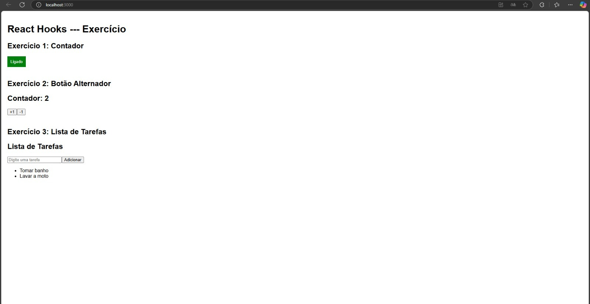

# Atividade Kayo - React Hooks

# Componente `Contador`

O componente `Contador` é um exemplo prático de como utilizar o hook `useState` do React para gerenciar estados. Ele implementa um contador simples que pode ser incrementado ou decrementado, com uma validação que impede que o valor fique negativo. Além disso, permite adicionar dinamicamente um título que pode ser definido via propriedades (props).

## Estrutura do Componente

### Código Completo
```javascript
import React, { useState } from 'react';

function Contador({ titulo }) {
    const [contador, setContador] = useState(0);

    const incrementar = () => setContador(contador + 1);
    const decrementar = () => {
        if (contador > 0) {
            setContador(contador - 1);
        }
    };

    return (
        <div>
            <h2>{titulo}</h2> {/* Título dinâmico */}
            <h1>Contador: {contador}</h1>
            <button onClick={incrementar}>+1</button>
            <button onClick={decrementar}>-1</button>
        </div>
    );
}

export default Contador;
```

---

## Explicação do Código

### Importação de Dependências
```javascript
import React, { useState } from 'react';
```
- Importa o React para criar o componente.
- Importa o hook `useState`, que é usado para gerenciar o estado do contador.

---

### Função Principal
```javascript
function Contador({ titulo }) {
```
- Declara o componente `Contador` como uma função.
- Recebe a propriedade `titulo`, que será exibida como título do contador.

---

### Estado do Contador
```javascript
const [contador, setContador] = useState(0);
```
- Inicializa o estado `contador` com o valor `0`.
- `setContador` é a função usada para atualizar o estado.

---

### Funções de Incremento e Decremento
```javascript
const incrementar = () => setContador(contador + 1);
```
- Função chamada ao clicar no botão de incrementar.
- Incrementa o estado `contador` em 1.

```javascript
const decrementar = () => {
    if (contador > 0) {
        setContador(contador - 1);
    }
};
```
- Função chamada ao clicar no botão de decrementar.
- Decrementa o estado `contador` em 1, mas só se o valor for maior que `0`.

---

# Componente `BotaoAlternador`

O componente `BotaoAlternador` demonstra o uso do hook `useState` do React para alternar entre dois estados, "Ligado" e "Desligado". Ele também exibe diferentes estilos visuais com base no estado atual.

---

## Estrutura do Componente

### Código Completo
```javascript
import React, { useState } from 'react';

function BotaoAlternador() {
    const [ligado, setLigado] = useState(false);

    const alternarEstado = () => setLigado(!ligado);

    return (
        <button 
            onClick={alternarEstado} 
            style={{
                backgroundColor: ligado ? 'green' : 'red', 
                color: 'white',
                padding: '10px 20px',
                border: 'none',
                borderRadius: '5px',
                cursor: 'pointer'
            }}
        >
            {ligado ? 'Ligado' : 'Desligado'}
        </button>
    );
}

export default BotaoAlternador;
```

---

## Explicação do Código

### Importação de Dependências
```javascript
import React, { useState } from 'react';
```
- Importa o React, que é necessário para criar componentes.
- Importa o hook `useState`, utilizado para gerenciar o estado do botão.

---

### Estado do Botão
```javascript
const [ligado, setLigado] = useState(false);
```
- Define um estado chamado `ligado` que é inicializado com `false`.
- `setLigado` é a função usada para atualizar o estado.
- O estado `ligado` controla se o botão está em estado "Ligado" (`true`) ou "Desligado" (`false`).

---

### Função de Alternância
```javascript
const alternarEstado = () => setLigado(!ligado);
```
- Define a função `alternarEstado`, que é executada ao clicar no botão.
- Inverte o estado atual de `ligado` com o operador lógico `!`.

---

### Estilo da interface
```javascript
style={{
    backgroundColor: ligado ? 'green' : 'red', 
    color: 'white',
    padding: '10px 20px',
    border: 'none',
    borderRadius: '5px',
    cursor: 'pointer'
}}
```
- O botão recebe diferentes estilos baseados no estado `ligado`:
  - **Cor de fundo**: `green` (Ligado) ou `red` (Desligado).
  - **Outros estilos**: Texto em branco, espaçamento interno, sem bordas, bordas arredondadas e cursor pointer.

---

# Componente `ListaDeTarefas`

O componente `ListaDeTarefas` é uma implementação simples de uma lista de tarefas interativa. Ele utiliza o hook `useState` do React para gerenciar o estado de uma lista e o campo de entrada de texto. Os usuários podem adicionar tarefas à lista e removê-las ao clicar sobre elas.

---

## Estrutura do Componente

### Código Completo
```javascript
import React, { useState } from 'react';

function ListaDeTarefas() {
    const [tarefa, setTarefa] = useState('');
    const [tarefas, setTarefas] = useState([]);

    const adicionarTarefa = () => {
        if (tarefa.trim()) {
            setTarefas([...tarefas, tarefa]);
            setTarefa('');
        }
    };

    const removerTarefa = (index) => {
        setTarefas(tarefas.filter((_, i) => i !== index));
    };

    return (
        <div>
            <h1>Lista de Tarefas</h1>
            <input
                type="text"
                value={tarefa}
                onChange={(e) => setTarefa(e.target.value)}
                placeholder="Digite uma tarefa"
            />
            <button onClick={adicionarTarefa}>Adicionar</button>
            <ul>
                {tarefas.map((tarefa, index) => (
                    <li key={index} onClick={() => removerTarefa(index)}>
                        {tarefa}
                    </li>
                ))}
            </ul>
        </div>
    );
}

export default ListaDeTarefas;
```

---

## Explicação do Código

### Importação de Dependências
```javascript
import React, { useState } from 'react';
```
- Importa o React e o hook `useState`, que será usado para gerenciar o estado da lista de tarefas e o valor do campo de entrada.

---

### Declaração dos Estados
```javascript
const [tarefa, setTarefa] = useState('');
const [tarefas, setTarefas] = useState([]);
```
- **`tarefa`**: Estado para armazenar o valor do campo de entrada de texto.
- **`tarefas`**: Estado para armazenar a lista de tarefas como um array de strings.

---

### Função para Adicionar Tarefas
```javascript
const adicionarTarefa = () => {
    if (tarefa.trim()) {
        setTarefas([...tarefas, tarefa]);
        setTarefa('');
    }
};
```
- Verifica se o campo de entrada não está vazio (`tarefa.trim()`).
- Adiciona o valor de `tarefa` ao array `tarefas`.
- Limpa o campo de entrada ao redefinir o estado de `tarefa` para uma string vazia (`''`).

---

### Função para Remover Tarefas
```javascript
const removerTarefa = (index) => {
    setTarefas(tarefas.filter((_, i) => i !== index));
};
```
- Remove uma tarefa específica ao filtrar o array de tarefas, excluindo o índice clicado.

---


